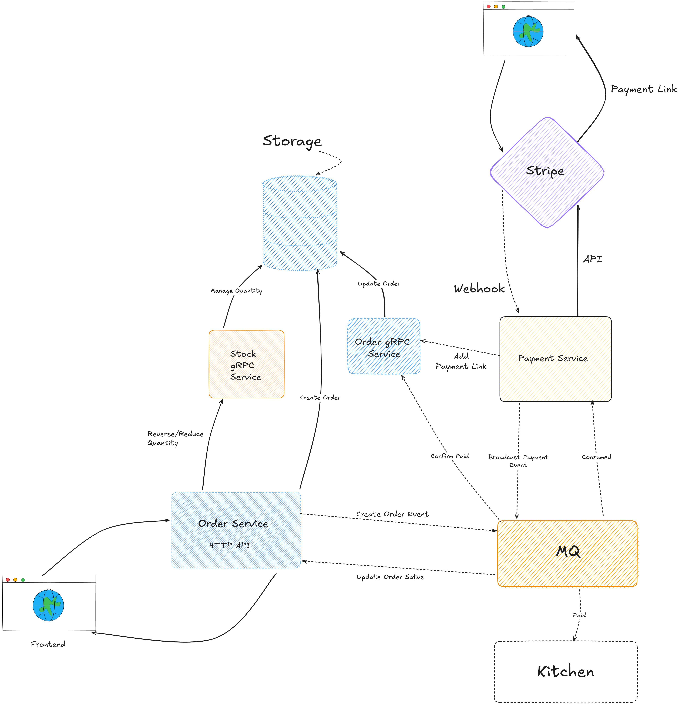

# GOrder

基于领域驱动设计（DDD）和 Clean Architecture 的微服务订单支付系统



## 概述

GOrder 是一个订单管理系统，采用微服务架构拆分为多个独立服务，通过消息队列实现异步通信，项目使用 Clean Architecture 分层设计，应用 CQRS 模式分离读写操作，并集成了服务发现、链路追踪、监控等基础设施

## 技术栈

- **Go 1.25** + gRPC + Gin
- **MongoDB**（订单存储）、**MySQL**（库存）、**Redis**（分布式锁）
- **RabbitMQ**（消息队列）、**Consul**（服务发现）
- **Jaeger**（链路追踪）、**Prometheus**（监控）、**Grafana**（可视化）

## 服务架构

### 服务划分

```
├── Order Service    # 订单服务（HTTP + gRPC）
├── Stock Service    # 库存服务（gRPC）
├── Payment Service  # 支付服务（HTTP，集成 Stripe）
└── Kitchen Service  # 厨房服务（事件消费者）
```

### 分层结构

每个服务遵循 Clean Architecture 四层设计：

```
domain/      # 领域层：实体、仓储接口
app/         # 应用层：Command/Query 处理器
adapter/     # 适配器层：数据库、第三方服务集成
ports/       # 端口层：gRPC/HTTP 接口
```

**核心原则**：
- 依赖方向由外向内（domain 层零依赖）
- 通过接口实现依赖倒置
- 充血模型封装业务逻辑

## CQRS + 装饰器模式

项目使用泛型实现统一的 Command/Query 处理：

```go
// Command 处理器（写操作）
type CommandHandler[C, R any] interface {
    Handle(ctx context.Context, cmd C) (R, error)
}

// Query 处理器（读操作）
type QueryHandler[Q, R any] interface {
    Handle(ctx context.Context, query Q) (R, error)
}
```

通过装饰器无侵入式添加日志、指标等功能：

```go
ApplyCommandDecorators(handler, logger, metrics)
```

装饰器调用链：`Logging → Metrics → 核心逻辑`

## 服务说明

### Order Service

订单管理服务，支持创建、查询、更新订单

- **数据库**：MongoDB
- **职责**：
  - 订单 CRUD 操作
  - 订单状态流转（待支付 → 已支付 → 已完成/已取消）
  - 发布订单事件到 RabbitMQ

### Stock Service

库存管理服务，防止超卖

- **数据库**：MySQL + Redis
- **职责**：
  - SKU 库存增减
  - Redis 分布式锁保证并发安全
  - 库存不足时触发订单取消

### Payment Service

支付服务，集成 Stripe 支付网关

- **职责**：
  - 创建支付链接
  - 处理 Webhook 回调
  - 发布支付成功/失败事件

### Kitchen Service

后台消费者服务

- **职责**：
  - 监听订单支付事件
  - 模拟处理订单
  - 更新订单状态

## 分布式特性

### 服务发现

使用 Consul 实现服务注册与发现：
- 服务启动时自动注册到 Consul
- gRPC 客户端通过服务名解析地址
- 支持多实例部署和健康检查

### 消息队列

RabbitMQ 实现服务间异步通信：
- Order 发布 `order.created` 事件 → Payment 监听（创建支付链接）
- Payment 发布 `order.paid` 事件 → Order 监听（更新订单状态）
- Payment 发布 `order.paid` 事件 → Kitchen 监听（处理订单）

### 链路追踪

基于 OpenTelemetry + Jaeger：
- 提供统一的 Tracer 初始化和上下文管理
- 在业务代码中手动集成 Span 创建和传播

### 指标监控

Prometheus + Grafana：
- 装饰器自动采集 Command/Query 指标
- HTTP/gRPC 请求指标
- 自定义业务指标

## 项目结构

```
internal/
├── common/           # 公共组件
│   ├── genproto/    # Protobuf 生成代码
│   ├── config/      # 配置管理
│   ├── logging/     # 日志
│   ├── consts/      # 常量定义
│   ├── discovery/   # 服务发现
│   ├── broker/      # 消息队列
│   ├── decorator/   # CQRS 装饰器
│   ├── tracing/     # 链路追踪
│   └── metrics/     # 指标
├── order/           # 订单服务
├── stock/           # 库存服务
├── payment/         # 支付服务
└── kitchen/         # 厨房服务
```

## 快速开始

### 启动基础设施

```bash
docker-compose up -d
```

启动服务：MySQL、MongoDB、Redis、RabbitMQ、Consul、Jaeger、Prometheus、Grafana

### 生成代码

```bash
# 生成 Protobuf 代码
make genproto

# 生成 OpenAPI 客户端
make genopenapi

# 一次性生成
make gen
```

### 启动服务

```bash
# Order 服务
cd internal/order && go run main.go

# Stock 服务
cd internal/stock && go run main.go

# Payment 服务
cd internal/payment && go run main.go

# Kitchen 服务
cd internal/kitchen && go run main.go
```

## Makefile

```bash
# 格式化
make fmt

# 代码检查
make lint

# 整理依赖
make tidy
```

## 相关文档

- [CQRS 模式说明](docs/CQRS.md)